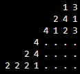
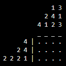

- [Algorithms](#algorithms)
  - [Overlaps](#overlaps)
  - [Out Of Reach Cut-off](#out-of-reach-cut-off)
  - [Filling cut-out ranges](#filling-cut-out-ranges)
  - [Error Cut-off](#error-cut-off)
    - [Filled spaces](#filled-spaces)
    - [Not enough empty space](#not-enough-empty-space)
  - [Trivial lines](#trivial-lines)
- [Known issues / Planned features](#known-issues--planned-features)
  - [Two-digit numbers](#two-digit-numbers)
  - [No visible border between numbers and board](#no-visible-border-between-numbers-and-board)

# Algorithms
<small>As in: the main ways the solver will fill out the boxes</small>

## Overlaps

```
7 12 |1 1 1 1 1 1 1 . 2 2 2 2 2 2 2 2 2 2 2 2 . . . . .|
7 12 |. . . . . 1 1 1 1 1 1 1 . 2 2 2 2 2 2 2 2 2 2 2 2|
7 12 |. . . . . O O . . . . . . O O O O O O O . . . . .|
```

1) Arr1 from left/up using number id
2) Arr2 from right/down using number id
3) Check overlaps of same ids

## Out Of Reach Cut-off

```
5 |. . . O . . . . . . . . . . . . . . . . . . . . .|
5 |. . . O . . . . X X X X X X X X X X X X X X X X X|
```

- If 1 left and at least 1 unit known
  - Go from the unit, for the length of the unit, starting from end opposite to direction, mark as `X` beyond. (both ways)

## Filling cut-out ranges

```
5 |. . . O . . . . X X X X X X X X X X X X X X X X X|
5 |. . . O O . . . X X X X X X X X X X X X X X X X X|
```

- If 1 left and at least 1 unit known
  - Go from the unit, for the length of the unit, bounce at the wall, continue from unit on the opposite side, marking as `O`. (both ways)

## Error Cut-off

### Filled spaces

```
4 3 |. O O O . X X O O X X X X X X X X X|
4 3 |. O O O . X E O O E X X X X X X X X|
```
```
4 3 |. O O O . X O O O O X X X X X X X X|
4 3 |. O O O . X E O O E X X X X X X X X|
```

- Check if each element surrounded by `X` is correct length
  - If element is too short, mark element-overlapping `X` as erroneus and throw
  - If element is too long, mark non-in-element-overlapping `O` as erroneus and throw

### Not enough empty space

```
4 |X . . . X X X X X X X X X X X X X X|
4 |E . . . E X X X X X X X X X X X X X|
```

- Check each element and each free space
  - If all free spaces are too small for the element, mark element-overlapping `X` as erroneus and throw

## Trivial lines
<u>Run before main loop</u>

```
10 |. . . . . . . . . .|
10 |O O O O O O O O O O|
```
```
3 1 2 1 |. . . . . . . . . .|
3 1 2 1 |O O O X O X O O X O|
```

- Check if element === width/height
  - Mark full row/column as `O`
- Check if sum of elements + breaks === width/height
  - Fill full row/column

# Known issues / Planned features

## Two-digit numbers

Currently, two digit numbers cause line offsets in the `Nonogram.fullBoard` output.  
Unfortunatelly, there are no plans on how fix that without making each digit (either just in column, or all) two character long.

## No visible border between numbers and board

The board is currently displayed next to numbers without any visible border:  
  
There will be a separation, most likely this way (and probably is going to be around whole board):  
